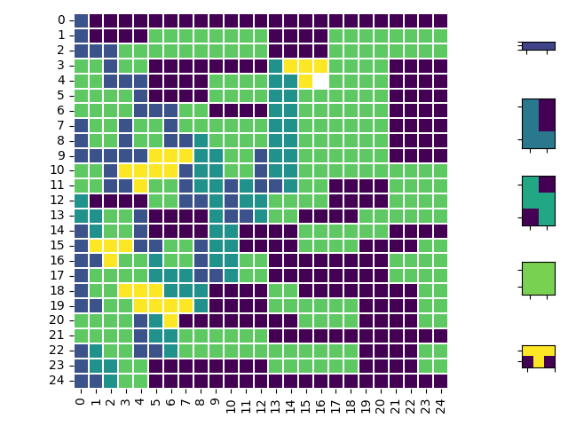

# Lego Brick Stacking in 2D 
This method can be extended into 3D. 

## This is packing problem or covering problem
* https://en.wikipedia.org/wiki/Packing_problems 
* https://en.wikipedia.org/wiki/Covering_problems

## Example: 
The N=25 problem with polyomino-set takes ~ 1 second to solve 

```
BASE CNF size
clauses:  31509
vars:  13910
CORE LOOP
 N_FIELDS >=  625
 N_FIELDS >=  624
 SOL found:  624
[[2 1 1 1 1 1 1 1 1 1 1 1 1 1 1 1 1 1 1 1 1 1 1 1 1]
 [2 1 1 1 1 4 4 4 4 4 4 4 4 1 1 1 1 4 4 4 4 4 4 4 4]
 [2 2 2 4 4 4 4 4 4 4 4 4 4 1 1 1 1 4 4 4 4 4 4 4 4]
 [4 4 2 4 4 1 1 1 1 1 1 1 1 3 5 5 5 4 4 4 4 1 1 1 1]
 [4 4 2 2 2 1 1 1 1 4 4 4 4 3 3 5 0 4 4 4 4 1 1 1 1]
 [4 4 4 4 2 1 1 1 1 4 4 4 4 3 3 4 4 4 4 4 4 1 1 1 1]
 [4 4 4 4 2 2 2 4 4 1 1 1 1 3 3 4 4 4 4 4 4 1 1 1 1]
 [2 4 4 2 4 4 2 4 4 4 4 4 4 3 3 4 4 4 4 4 4 1 1 1 1]
 [2 4 4 2 4 4 2 2 3 4 4 4 4 3 3 4 4 4 4 4 4 1 1 1 1]
 [2 2 2 2 2 5 5 5 3 3 4 4 2 3 3 4 4 4 4 4 4 1 1 1 1]
 [4 4 2 5 5 5 5 2 3 3 4 4 2 3 3 4 4 4 4 4 4 4 4 4 4]
 [4 4 2 2 5 4 4 2 3 3 2 3 2 2 3 4 4 1 1 1 1 4 4 4 4]
 [3 1 1 1 1 4 4 2 2 3 2 3 3 4 4 4 4 1 1 1 1 4 4 4 4]
 [3 3 4 4 2 1 1 1 1 3 2 2 3 4 4 1 1 1 1 4 4 4 4 4 4]
 [2 3 4 4 2 1 1 1 1 3 3 1 1 1 1 4 4 4 4 4 4 1 1 1 1]
 [2 5 5 5 2 2 4 4 2 3 3 1 1 1 1 4 4 4 4 1 1 1 1 4 4]
 [2 2 5 4 4 3 4 4 2 3 3 4 4 1 1 1 1 1 1 1 1 4 4 4 4]
 [2 4 4 4 4 3 3 3 2 2 3 4 4 1 1 1 1 1 1 1 1 4 4 4 4]
 [2 4 4 5 5 5 3 3 3 1 1 1 1 4 4 1 1 1 1 1 1 1 1 4 4]
 [2 2 4 4 5 5 5 5 3 1 1 1 1 4 4 4 4 4 4 1 1 1 1 4 4]
 [4 4 4 4 2 3 5 1 1 1 1 1 1 1 1 4 4 4 4 1 1 1 1 4 4]
 [4 4 4 4 2 3 3 4 4 4 4 4 4 1 1 1 1 1 1 1 1 1 1 1 1]
 [2 3 4 4 2 2 3 4 4 4 4 4 4 4 4 4 4 4 4 1 1 1 1 4 4]
 [2 3 3 4 4 1 1 1 1 1 1 1 1 4 4 4 4 4 4 1 1 1 1 4 4]
 [2 2 3 4 4 1 1 1 1 1 1 1 1 1 1 1 1 1 1 1 1 1 1 1 1]]
```



## Formulate these constrains into a set of clauses and use SAT-Solvers to find the soltion (Many solution exists) 
The general approach is creating a decision-problem and transforming it into CNF, which is then solved by highly efficient SAT-solvers (here: cryptominisat; CNF will be in DIMCAS-CNF format), which will be used as black-box solvers (no parameter-tuning!).

As the goal is to optimize the number of filled tiles and we are using a decision-problem, we need an outer-loop, adding a minimum tile-used constraint and try to solve it. If not successful, decrease this number. So in general we are calling the SAT-solver multiple times (from scratch!).

There are many different formulations / transformations to CNF possible. Here we use (binary) decision-variables X which indicate a placement. A placement is a tuple like polyomino, x_index, y_index (this index marks the top-left field of some pattern). There is a one-to-one mapping between the number of variables and the number of possible placements of all polyominos.

The core idea is: search in the space of all possible placement-combinations for one solution, which is not invalidating some constraints.

Additionally, we have decision-variables Y, which indicate a tile being filled. There are M*N such variables.

When having access to all possible placements, it's easy to calculate a collision-set for each tile-index (M*N). Given some fixed tile, we can check which placements can fill this one and constrain the problem to only select <=1 of those. This is active on X. In the (M)IP world this probably would be called convex-hull for the collisions.

n<=k-constraints are ubiquitous in SAT-solving and many different formulations are possible. Naive-encoding would need an exponential number of clauses in general which easily becomes infeasibly. Using new variables, there are many variable-clause trade-offs (see Tseitin-encoding) possible. I'm reusing one (old code; only reason why my code is python2-only) which worked good for me in the past. It's based on describing hardware-based counter-logic into CNF and provides good empirical- and theoretical performance (see paper). Of course there are many alternatives.

Additionally, we need to force the SAT-solver not to make all variables negative. We have to add constraints describing the following (that's one approach):

if some field is used: there has to be at least one placement active (poly + x + y), which results in covering this field!
this is a basic logical implication easily formulated as one potentially big logical or
Then only the core-loop is missing, trying to fill N fields, then N-1 until successful. This is again using the n<=k formulation mentioned earlier.

## Reference: 
* https://en.wikipedia.org/wiki/Packing_problems
* https://stackoverflow.com/questions/47918792/2d-bin-packing-on-a-grid

