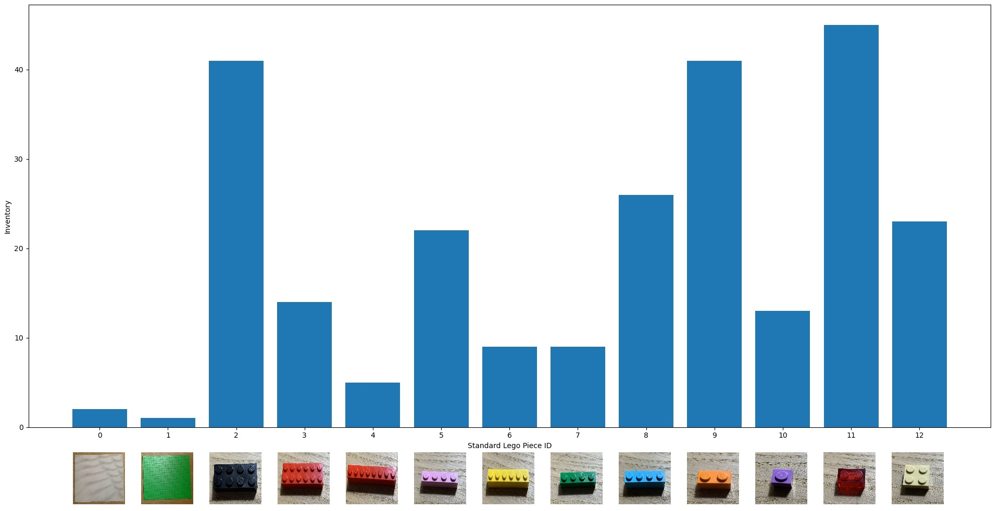

# LEGO_Assembly_Planning
## Standard LEGO bricks
The standard LEGO bricks have an identical height of 0.96cm.

`standard_lego_library.yaml` is a library containing available standard LEGO bricks that can be used in prototyping.

Each brick type is stored in the library as
* Piece ID: 
    * height: height $\leq$ width.
    * width: height $\leq$ width.
    * color
    * inventory: the number of available bricks.

### Standard LEGO bricks inventory

## Assembly List
`example_list.yaml` is a graph containing required LEGO bricks for an assembly task.

Each node is represented as
* Seq_ID:
    * id: piece id in the brick library.
    * ori: orientation of the brick. `0`: same as defined in the library. `1`: rotate 90 degree.
    * x: top-left corner horizontal position on the board (after applying the orientation).
    * y: top-left corner vertical position on the board (after applying the orientation).

PROGRESS:
3/26
Figured out the issue wasn't behind incorrect order labeling but rather checking bounds.
The problem with the bounds was that orientation wasn't accounted for.

3/29:
The way i coded this is very regrettable and I feel like im getting closer but I might have to restart only 
because there are prob way easier approaches than this

3/31:
The problem was that I didn't account for same line for y axis